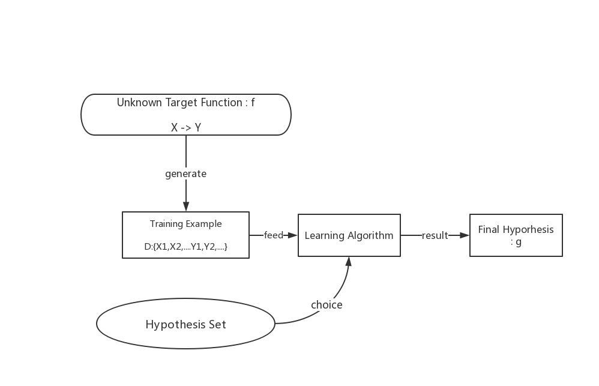
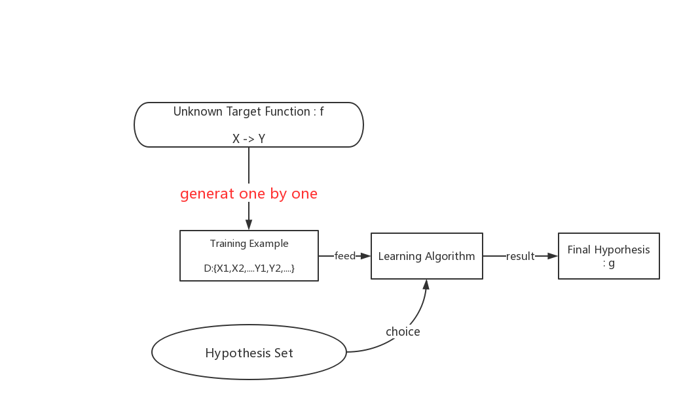
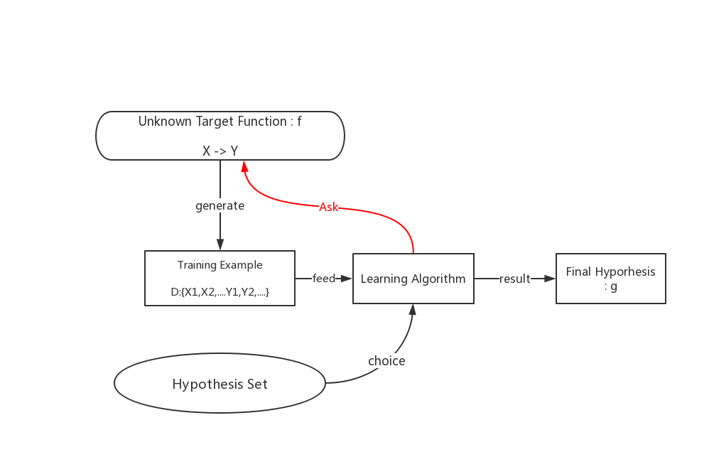

# 各式各样的机器学习

## 从output区分
- 二分类：即是否问题，比如判断是否垃圾邮件；
- 多分类：有限的大于两个的类别问题，比如判断癌症的种类；
- 回归：输出为实数，可以是整个实数范围，可以是固定范围内的实数，比如分数为0~100内的实数；
- 结构化学习：输出无法穷举出来，比如对一句话做词性标注后，输出每个词词性组成的字符串，这个结果是有一定结构的，但是无法穷举，因此属于结构化学习；

## 根据label区分
- 监督学习：any Yn
- 非监督学习：no Yn
- 半监督学习semi：some Yn
- 强化学习：通过奖励、惩罚机制来学习

## 按照协议区分
- batch学习：一次送入全部数据；

- online学习：数据是一条一条送入的，强化学习、PLA等很多都应用于online学习；

- activte学习：主动学习的特点在于当算法有疑惑时，会主动询问它当前的x对应的y来确保自己的正确与否；

## 以input来划分
- concrete feature：具有实际、具体、业务意义的特征，即高维度特征，比如年龄、性别、收入等；
- raw feature：仅具有物理意义的，比如像素点信息；
- abstract feature：仅具有一点或不具备物理意义的抽象特征，例如ID；

通常来说，越高维度的特征对ML来说越简单，而DL目前在做的就是在低维度特征上解决问题，即自动抽取高维度特征；
