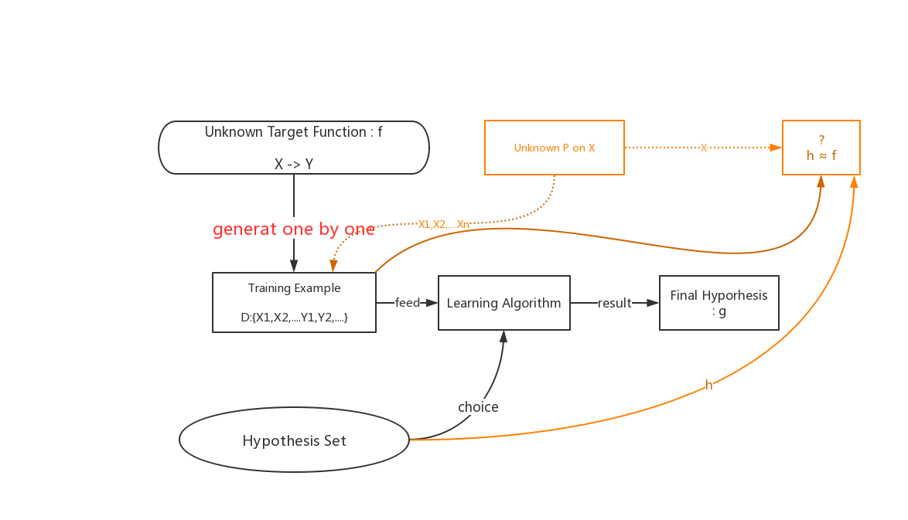

# 机器学习的可行性

## 知识
- 机器学习是不可能的原因：
    - 当存在多个h，对应现有数据结果一致时，无法判断应该选择哪个；
- 推论、估计：
    - 通过随机独立抽样，通过样本概率估计总体概率，利用统计学知识；
    
- 与ML关系：
    - 总体概率相当于不知道的f，抽样的样本相当于Data，H相当于各种样本概率估计；
- 实际ML：
    - 坏数据：训练算法无法正确选择g；
    - 好数据：训练算法可以根据自身模式自由选择；

足够大的N、有限的H，使得ML是可能的；
