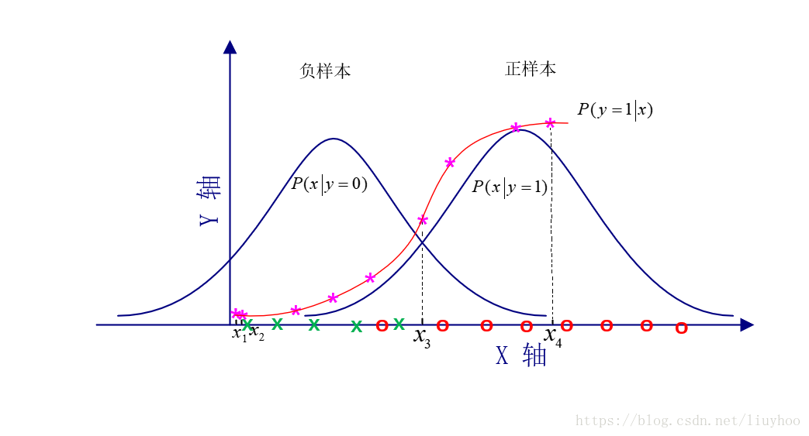

# 逻辑回归

知识点：
1. 逻辑回归与线性分类、线性回归的异同：
    1. 相同，输入都是对x的加权和；
    2. 不同：
        1. 线性分类的输出是经过了sign操作，因此输出为正负；
        2. 线性回归的输出是直接输出加权和；
        3. 逻辑回归的输出是经过sigmoid函数，结果为0~1之间；
2. 最优化通过梯度下降，通常eta与坡地成比例关系，坡度越大，eta越大，反之亦然是一种较好的eta选择，也称为学习率；
3. 为什么逻辑回归选择sigmoid函数做归一化：实际上并不能说是逻辑回归选择了sigmoid函数，而是在逻辑回归的推导中，出现了sigmoid函数的公式，或者说是逻辑回归本身具备归一化特性，这一点[直观理解](https://blog.csdn.net/liuyhoo/article/details/81558350)如下图，逻辑回归假设正负样本都符合均值不同的高斯分布，绘制出来后，发现，二者的叠加很类似sigmoid函数的图形，这一点也符合公式推导中出现的情况：

