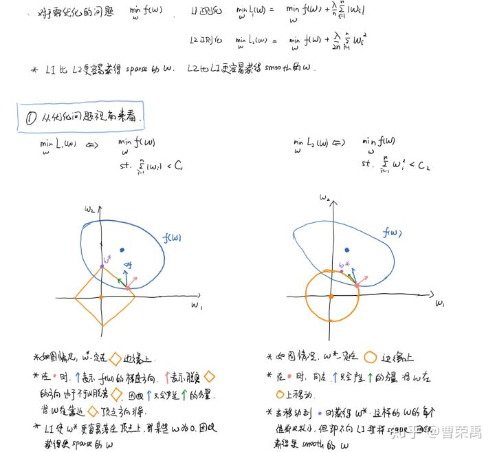
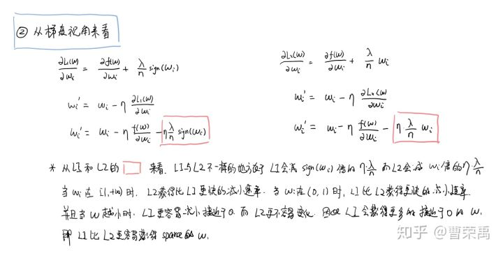
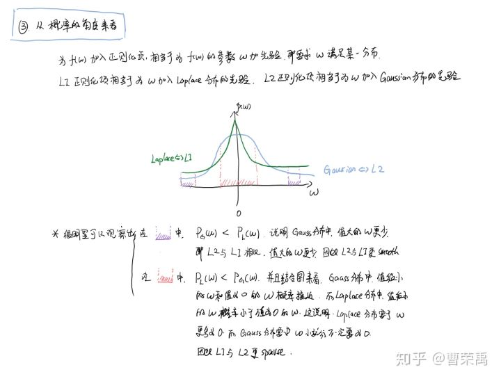

# 正则化

知识点：
1. 正则化即通过加入条件对模型复杂度进行限制，体现在对w的限制上；
2. 两种限制思路：
    - 限制有效的w个数；
    - 限制w的平方和；
    - 相对来说，H(c)更加平滑，c为实数范围，而个数是跳跃式的(1~N的整数)；
3. 有条件的最优化问题：
    - 无条件使用梯度下降，朝梯度方向下降即可；
    - 加入条件后，下降时要同时满足增加的条件以及下降；
4. L1和L2正则化：
    
    
    
5. noise越高，λ就要越高，意思就是越多的噪声，就应该越大的正则化力度，即更大的λ，更小的C，对模型的限制更强；
